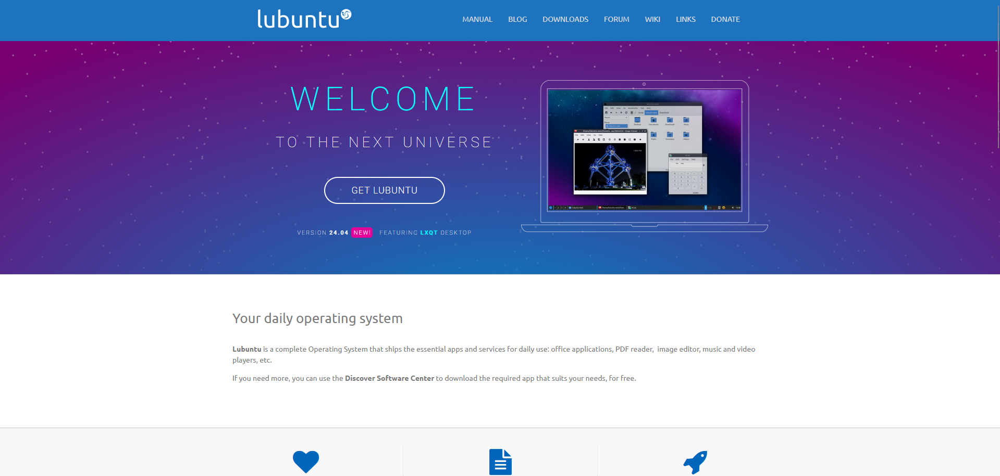

# Heber Daniel Duarte Vasquez 202108630  
## Primer semestre 2025  
## Practicas iniciales Sección C

# MANUAL

## INSTALACIÓN DE LINUX

### Instalación de Lubuntu en el disco del equipo (No virtualización)

**Materiales:**  
- Unidad de almacenamiento externa (preferiblemente USB)  
- Acceso a internet  

### Paso 1:  
Ingresar a la página de descarga de la ISO, en este caso es [https://lubuntu.me/](https://lubuntu.me/)

### Paso 2:  
Ya en la página, damos click en **DOWNLOADS**

### Paso 3:  
Vamos a descargar la última versión LTS (Long Term Support), en este caso la **24.04.2 LTS**.

### Paso 4:  
Descargamos una herramienta de creación USB arrancable, en este caso usaremos **Rufus**. Por lo que hay que dirigirse a [https://rufus.ie/es/](https://rufus.ie/es/) y hacer click donde marca la imagen.

### Paso 5:  
En la herramienta **Rufus**, damos a **Seleccionar** y seleccionamos la imagen ISO de Lubuntu que descargamos previamente. Seleccionamos la unidad de USB a utilizar y damos a **Empezar**.

### Paso 6:  
Reiniciamos la PC.

### Paso 7:  
Entramos a la BIOS cuando se está produciendo el proceso de arranque. Esto generalmente se hace con **F2**, pero depende del equipo, por lo que debe consultar la tecla que funciona con su modelo.

### Paso 8:  
Ya en la BIOS, solo tenemos que cambiar la prioridad de arranque, colocando con el mouse nuestra unidad USB en la cima de las unidades de almacenamiento.  
*(En modelos más antiguos puede que no se pueda utilizar el ratón, por lo que deberá investigar cómo se realiza esta operación para su modelo específico.)*

### Paso 9:  
Aparecerá una pantalla con las opciones de la imagen a la cual debemos dar **Enter** en **Try or install Lubuntu**.

### Paso 10:  
En esta pantalla, debemos dar click en **Install Lubuntu**.

### Paso 11:  
Damos click en **Siguiente** en las pantallas venideras, ya que las opciones por defecto son las óptimas, a menos que de verdad necesitemos cambiar algo, lo hacemos. Esto se hace hasta llegar a la pantalla de la siguiente imagen, que necesita un poco más de explicación.

### Paso 12:  
En esta pantalla, seleccionamos la primera opción si deseamos borrar por completo el disco para instalar el nuevo sistema operativo. Si contamos con conocimiento sobre las particiones de un disco y deseamos realizar alguno, la segunda opción nos dejará hacerlos.  
**Cabe aclarar que si no se sabe qué se está haciendo, se RECOMIENDA la primera opción.**

### Paso 13:  
En esta pantalla, llenamos los datos que solicita y damos **Siguiente**.

### Paso 14:  
En esta pantalla aparecerá un resumen con las opciones que hemos ido seleccionando hasta ahora, por lo que vale la pena dar una última revisada y verificar que todo esté correcto. Si es así, damos a **Install Now**.

### Paso 15:  
Comenzará a instalarse el sistema operativo, por lo que debemos ser pacientes, ya que el tiempo de esta operación variará en función de las capacidades del equipo que estemos usando.

### Paso 16:  
Terminará la instalación y nos pedirá reiniciar el equipo, por lo que hacemos click en **Done**.

### Paso 17:  
Después de reiniciar, aparecerá esta pantalla. En este punto, retiramos la USB y damos **Enter**.

### Paso 18:  
Y aquí ya tenemos el Linux instalado en nuestro equipo, por lo que podemos empezar a usarlo y terminar de configurarlo para ajustarlo a nuestras necesidades.

---

# COMANDOS BÁSICOS DE TERMINAL

### Para navegar entre archivos y directorios.
`cd (nombreDelDirectorio)`  
Y `cd ..` sirve para subir un nivel en los directorios.

**Ejemplo:**  
`cd /home/usuario/documentos`

### Para ver el contenido de un directorio.
`ls` sirve para ver el contenido del directorio.

### Para crear carpetas en un directorio.
El comando `mkdir` crea un directorio en la ruta.

**Ejemplo:**  
`mkdir /home/usuario/Documentos/CarpetaCreada`

### Para copiar archivos y carpetas de un directorio a otro.
`cp (origen) (destino)`

**Ejemplo:**  
`cp documentoDeTexto.txt /home/usuario/Documentos/`

### Para mover archivos y carpetas de un directorio a otro.
`mv (origen) (destino)`

**Ejemplo:**  
`mv documentoPDF.pdf /home/usuario/Documentos/`

### Para eliminar archivos y carpetas de un directorio a otro.
`rm (archivo)`

**Ejemplo:**  
`rm Imagen.png`

### Para ingresar como Superusuario a la terminal.
`sudo su`

### Para actualizar los permisos a los archivos o directorios.
`chmod (permisos) (archivo_o_directorio)`

### Para crear/editar un archivo de texto desde la terminal.
`nano (nombre_del_archivo)`

**Ejemplo:**  
`nano archivo.txt`

### Para instalar paquetes desde la terminal.
`sudo apt install (nombre_paquete)`

**Ejemplo:**  
`sudo apt install vim`

### Para actualizar paquetes desde la terminal.
`sudo apt update`  
`sudo apt upgrade`

### Para eliminar paquetes desde la terminal.
`sudo apt remove (nombreDelPaquete)`

**Ejemplo:**  
`sudo apt remove vim`
